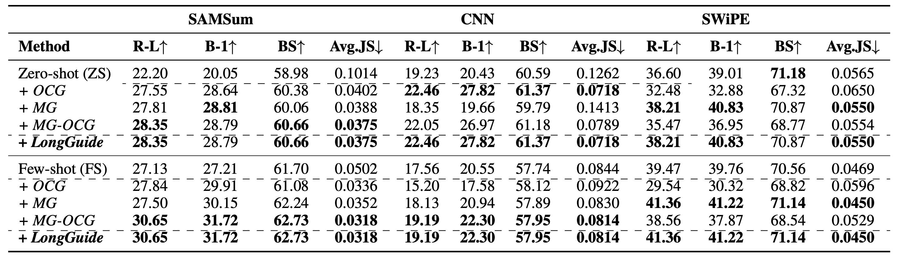
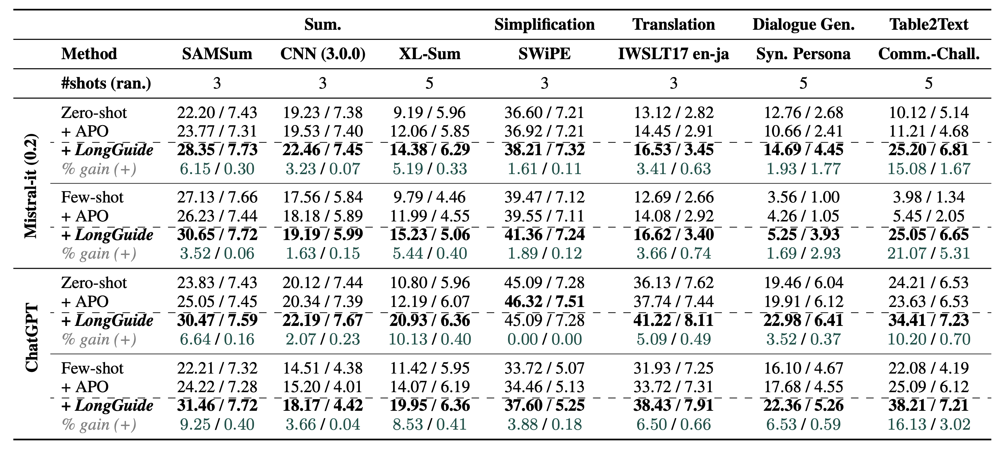
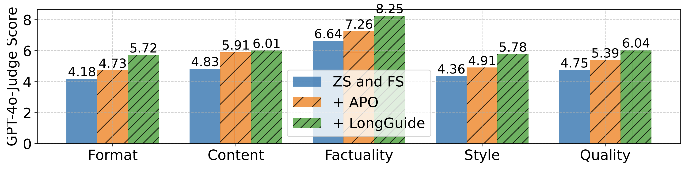
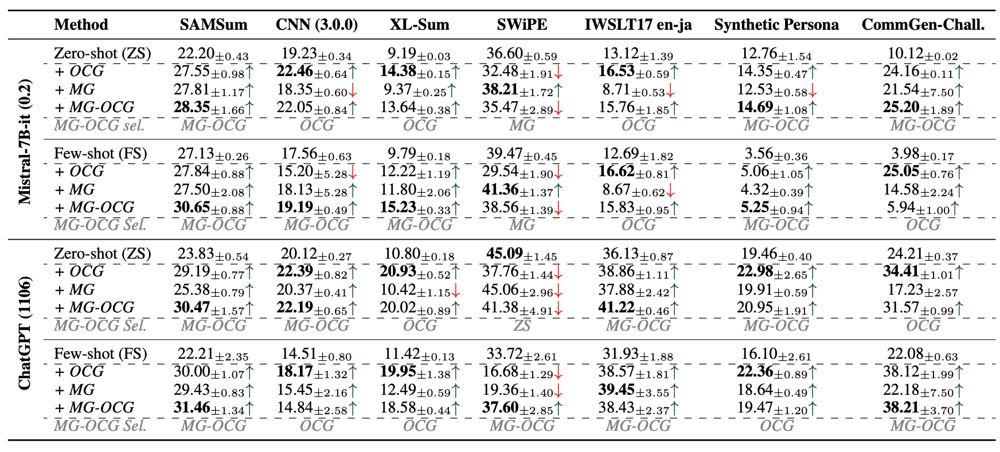
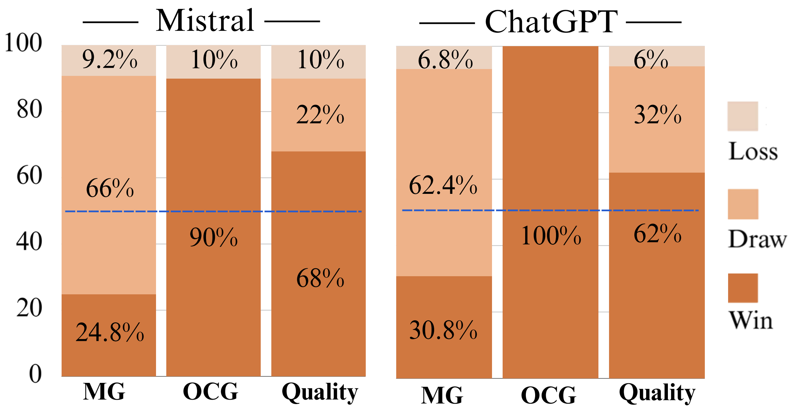
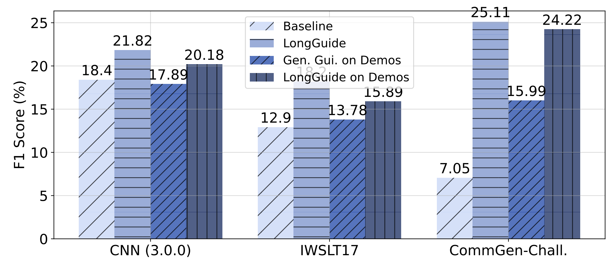

## Beyond Context Learning

更新日: 2025/06/12

---

### 【論文情報】
##### Beyond In-Context Learning: Aligning Long-form Generation of Large Language Models via Task-Inherent Attribute Guidelines	
 **Author:** Do Xuan Long, Duong Ngoc Yen, Do Xuan Trong, Luu Anh Tuan, Kenji Kawaguchi, Shafiq Joty, Min-Yen Kan, Nancy F. Chen
###### URL: [https://arxiv.org/pdf/2506.01265](https://arxiv.org/pdf/2506.01265)

 Published as a conference paper at cs.CL 2025

  <a style="background-color:rgb(99, 107, 101); color: white; padding: 10px 20px; text-decoration: none; border-radius: 5px; font-weight: bold;">
    GitHubリポジトリはありません
  </a>

---

## 論文の要約

### 1. この研究はどんな研究？
この研究は、大規模言語モデル（LLM）が文脈内学習（In-Context Learning, ICL）だけでは、要約などの長文生成タスクにおいて、タスクが求める言語的特性やフォーマットを一貫して維持することができないという課題に取り組んでいます 。
　この課題を解決するため、タスク固有のデータから言語とフォーマットの特性を自動的に学習し、それをLLMへの明確な指示（ガイドライン）として与えるアルゴリズム「LongGuide」を提案しています 。LongGuideは、Zero-shotおよびFew-shot学習の両設定において、既存の強力なLLMの性能を大幅に向上させることを目的としています 。

### 2. 先行研究は？それらの研究との差異は？
本研究は、主に以下の2つの分野の先行研究に基づいています。

- 長文生成のための自動プロンプト設計: 
  これまでの研究では、プロンプトベースの手法を用いてLLMを長文生成タスクに適応させようと試みてきましたが、生成物が必ずしも正解データ（ground truth）に類似しないという課題がありました 。
- LLMによる制御可能な生成: 
  ファインチューニングやプロンプティングによってLLMの生成を制御する研究は広く行われてきました 。

これらの先行研究と提案手法の主な差異は以下の通りです。

LongGuideは、**タスクの指示**を構築する既存研究とは異なり、学習した品質基準や定量的基準に基づいて応答を強化するための **「事後的（post-hoc）」** な指示を提供します 。
先行研究がプロンプト自体を最適化するのに対し、LongGuideはテキストの評価指標とフォーマットの制約を統合した「補足的なコンテキスト」を自律的に構成する点で独自性があります 。
制御可能な生成に関する研究と比較して、LongGuideのOCG（出力制約ガイドライン）は、要約タスクや自由形式の機能に限定されず、より普遍的に適用可能な特徴（文の数やトークン数など）に焦点を当てています 。

### 3. 提案手法では具体的にどんなことができる？何を示している？
提案手法「LongGuide」は、少量の訓練データを用いて、LLMの長文生成能力を向上させるためのガイドラインを効率的に自動生成するアルゴリズムです 。具体的には、以下の2種類のガイドラインを並行して生成します。

- **Metric Guidelines (MGs)**: 自己評価メトリクスを最適化するようにモデルを指示し、タスクに内在する言語的特性を捉えます 。これは、タスクに適した評価指標（例：正確性、簡潔さ）を自動で選択し、その指標に基づいた品質定義を生成することで実現されます 。
- **Output Constraint Guidelines (OCGs)**: 生成されるテキストのトークンレベルおよび文レベルでの制約（例：文の数、単語数）を課します 。正解データの長さに関する統計情報（最小、最大、平均）を計算し、それを基に制約を生成します 。

LongGuideはこれらのガイドラインの最適な組み合わせを自動で選択し、LLMに提供します 。この研究は、LongGuideを用いることで、Zero-shotおよびFew-shot設定において、強力なオープンソースおよびクローズドソースのLLMの性能を5%以上向上させることができることを示しています 。また、この手法は汎用性が高く、弱いモデルで学習したガイドラインを強いモデルに適用して性能を向上させることも可能です 。

提案手法の有効性を示すエビデンスとして、論文では複数の実験結果が提示されています。

- テキスト特性転移（PT）問題の軽減: 
  Table 2に示されるように、LongGuideは生成された回答と正解データの間の特性分布の差（Avg.JSダイバージェンスで測定）を大幅に減少させ、ICLだけでは困難なテキスト特性の転移を促進することを示しています 。
  
Table2: Mistral performance verifying LongGuide mitigates the text property transfer (PT) problem (§2): (1) the trends of ROUGE-L (R-L), BLEU-1 (B-1), BERTScore (BS), and Jensen–Shannon divergence (Avg. JS) show strong correlations, supporting our hypothesis; (2) LongGuide ubstantially enhances Avg. JS scores, thereby mitigating the PT problem.
</img>

- 各種タスクでの性能向上: 
  Table 3では、7つの異なる長文生成タスク（要約、テキスト簡略化、翻訳など）において、LongGuideがベースライン（ゼロショット、フューショット）およびプロンプト最適化手法（APO）をROUGE-LスコアとGPT-40-Judgeスコアの両方で大幅に上回ることが示されています 。特に、生成物のフォーマット、スタイル、事実性の改善が顕著です（Figure 3） 。
 
Table3: ROUGE-L / GPT-4o-Judge results on seven long-form generation tasks. LongGuide remarkably outperforms baselines on most tasks and substantially enhances LLMs. BLUE-1 scores are reported in Appx.-10.
</img>
 
 
Figure3: GPT-4-Judge scores over criteria.
</img>
- コンポーネントの有効性: 
  Table 4は、LongGuideの各コンポーネント（MG、OCG）の有効性を分析しており、多くの場合でMGとOCGを組み合わせた「MG-OCG」が最も高い性能を発揮することを示しています 。
- 人間による評価: Figure 4に示された人間による評価では、アノテーターの最大92%がLongGuideを使用した出力を支持しており、生成品質の向上も確認されています 。
-  
Table4: ROUGE-L results with 95% CI from t-test. The gains of LongGuide’s components vary across different models and
tasks. The “MG-OCG selection” results are reported in Appx.-Table 14.
</img>

 
Figure4: Win/Draw/Loss rates of w/ versus w/o LongGuide.
</img>
- デモンストレーションからの学習: 
  LongGuideは、ICLで使われる少数のデモンストレーション（事例）からガイドラインを学習し、ICLの性能をさらに向上させることができます（Figure 5） 。

 
Figure5: LongGuide learned from demonstrations substantially enhances Mistral performance (ROUGE-L).
</img>

### 4. 具体的理論は？
この研究の理論的基盤は、 **「テキスト特性転移（Text Property Transfer, PT）問題」** という概念に基づいています。
ICLの限界: 論文では、理論的および経験的に、LLMがタスクの真のデータ分布を完全には捉えていない場合($P_M=P_T$)、ICLでデモンストレーションを提供するだけでは、タスクが要求する言語的・形式的特性を生成物に一貫して反映させることはできないと主張しています 。これをPT問題と名付けています 。

理論的直感: LLMの確率分布（$P_M$）とタスクの真の確率分布（$P_T$）が異なるという現実的な仮定のもとでは、どのようなデモンストレーション（$D_f$）を与えても、条件付き確率分布が一致しない（$P_M​(X=x∣D_f)=P_T(X=x)$）ような入力（$x$）が存在することを示しています 。これは、デモンストレーションだけではLLMの生成をタスクに完全に整合させることは原理的に不可能であることを示唆しています。

仮説: このPT問題を解決するために、「元のタスクは、適切に選択された複数のテキスト特性タスクの最適化によって近似できる」という仮説を立てています 。つまり、簡潔さや正確さといった個別の特性を最適化するガイドラインを与えることで、間接的にタスク全体の性能を向上させることができると考えています 。LongGuideは、この仮説を具現化したアルゴリズムです。

### 5. 総括すると？
この研究は、大規模言語モデル（LLM）における文脈内学習（ICL）が、特に長文生成タスクにおいて、タスク固有の言語的特性やフォーマットを維持するには不十分であるという限界を明確にしました 。

この課題に対処するため、本研究は「LongGuide」という効率的なアルゴリズムを提案しました 。LongGuideは、少量のタスクデータから重要な言語特性（Metric Guidelines）とフォーマット特性（Output Constraint Guidelines）を自動的に抽出し、それらをLLMへの明確なテキストベースの指示に変換します 。

実験の結果、LongGuideは7つの主要な生成タスクにおいて、既存の強力なLLMの性能をゼロショットおよびフューショットの両方で大幅に向上させることが実証されました 。この手法は高い汎用性を持ち、最小限のデータで様々な下流タスクに応用できる可能性を秘めています 。

総じて、この研究は、LLMの性能を向上させるための新しいアプローチとして、タスクの特性を明示的にガイドするという手法の有効性を示し、適応的でタスク固有のプロンプト生成という分野における今後の研究の方向性を示した点で大きな貢献があると言えます 。